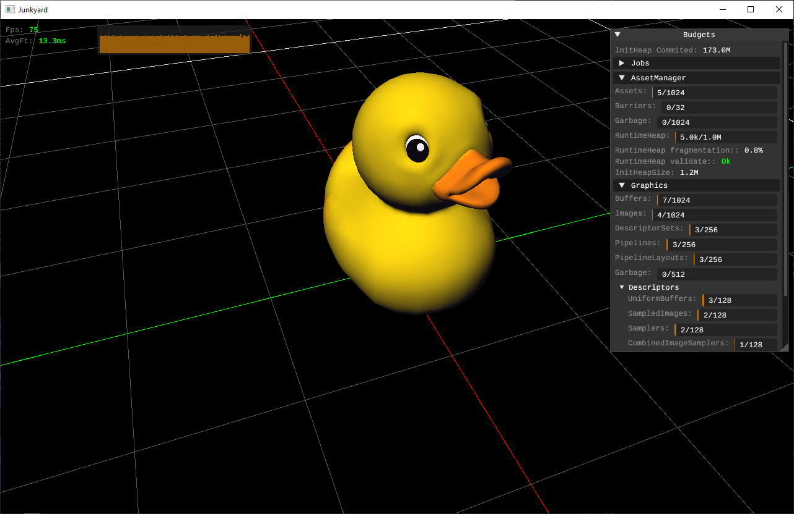

# Junkyard

Yet another multiplatform C++ framework to make games and maybe some other related high-performance applications.

The goal is to focus on simplicity, fast iteration and android/QuestVR development. Features will be developed based on the game/projects I do with it, so this is not going to be do-it-all engine/framework at all.

It's very much WIP, so not much to show off right now.



## Overview and Features

- Minimal C'ish C++20: Some people call it Sane-C++ or similarly [Orthodox-C++](https://gist.github.com/bkaradzic/2e39896bc7d8c34e042b). I use a small subset of newer C++ standards, in which I will explain later in the wiki. Some of them are pointed in [CppFeatures.txt](doc/CppFeatures.txt)
- No project-gen middleware is used. It has visual-studio solutions and another option for single file unity builds.
- Very strict memory allocation/resource allocation in most systems.
- Has it's own Core library: Array, Math, FileIO, HashTable, HandlePool, Buffers, Log, etc.
- Simple [Fiber-based job system](https://www.gdcvault.com/play/1022186/Parallelizing-the-Naughty-Dog-Engine)
- Vulkan graphics backend with HLSL shaders
- Multiplatform. Supported platforms:
    - Windows (x64)
    - Android (Android29+, ARM64)
- Fast iteration
    - Quick build/compile times
    - Aim for simple tooling with minimal abstraction or complexity
    - No asset upload/deployment on mobile/remote hardware
    - Hot-reloading assets
        - [x] Shaders
        - [x] Images
        - [ ] Models
- ImGui integration
- Simple Camera (Orbital + Fps)
- [Tracy profiler](https://github.com/wolfpld/tracy) integration
- Virtual filesystem 
- Async asset manager with remote baking on the server

## Dependencies
External dependencies are a pretty big deal imo, so I'm going to pay special attention to them. They are part of your code even if you don't write them yourself and they all play a big role in compile-times, maintainance, deployment and technical debt of your code. So I try to keep the dependencies small and to minimum. Also try to minimize the amount of unused code, meaning that if I plan to do A, I won't add a library that only 5% of it's code does A and the rest does something I don't use. Most of them are simple stb-style single-header C libs, but some just can't be as small and quick-to-compile as I want them to be. Anyway, here they are:

- [Git](https://git-scm.com/downloads) and [Git LFS](https://git-lfs.com/): Source control (make sure you have git-lfs installed by running `git lfs install`)
- [VulkanSDK](https://vulkan.lunarg.com/): Used for the graphics backend. 
- [c89atomics](https://github.com/mackron/c89atomic): Replacement for std atomics. Don't want to use `<atomic>` because it's part of std-C++ crap and it's [huge](https://build-bench.com/b/-_WeHavwOPkGBvI3ed5KNnpdgmk), and C11 `<stdatomic>` is not available for msvc2019. I might try to remove this for `<stdatomic>` if I intend to ditch msvc2019 and go strictly for msvc2022.
- [cj5](https://github.com/septag/cj5): single-header [JSON5](https://json5.org/) parser.
- [Tracy profiler](https://github.com/wolfpld/tracy): Frame profiler
- [dds-ktx](https://github.com/septag/dds-ktx): Portable single header DDS/KTX reader for C/C++
- [dmon](https://github.com/septag/dmon): Tiny C library that monitors changes in a directory
- [ImGui](https://github.com/ocornut/imgui): Bloat-free graphical user interface library for C++
- [ImGuizmo](https://github.com/CedricGuillemet/ImGuizmo): ImGui gizmo and some other useful widgets
- [INI parser](https://github.com/mattiasgustavsson/libs/blob/main/ini.h): Mattias Gustavsson single-header lib for parsing INI files
- [minicoro](https://github.com/edubart/minicoro): Single header asymmetric stackful cross-platform coroutine library in pure C.
- [stb](https://github.com/nothings/stb): stb single-file public domain libraries for C/C++
- [tlsf](https://github.com/mattconte/tlsf): Two-Level Segregated Fit memory allocator implementation.
- [Vulkan Memory allocator](https://github.com/GPUOpen-LibrariesAndSDKs/VulkanMemoryAllocator): Easy to integrate Vulkan memory allocation library
- [volk](https://github.com/zeux/volk): Meta loader for Vulkan API
- Tooling (only used in tooling/PC builds):
    - [ISPC Texture Compressor](https://github.com/septag/ISPCTextureCompressor): BC/ASTC texture compressor
    - [meshoptimizer](https://github.com/zeux/meshoptimizer): Mesh optimization library that makes meshes smaller and faster to render
    - [slang](https://github.com/shader-slang/slang): Shader transcompiler
    - [sokol_args](https://github.com/floooh/sokol/blob/master/sokol_args.h): Single-header lib for parsing command-line arguments
- Windows:
    - [DbgHelp](https://learn.microsoft.com/en-us/windows/win32/debug/dbghelp-functions): Windows debug helper module. 
- Android:
    - [cpufeatures](https://android.googlesource.com/platform/ndk/+/master/sources/android/cpufeatures/cpu-features.c): Fetch CPU information
- Optional:
    - [MemPro](https://puredevsoftware.com/mempro/index.htm): Commercial tool for debugging memory allocations
    - [Python 3.10+](https://www.python.org/downloads/): Used in some tooling scripts and utilities. 
    - [ScrCpy](https://github.com/Genymobile/scrcpy): Display and control your Android device
    - [Gnirehtet](https://github.com/Genymobile/gnirehtet): provides reverse tethering for Android

## Build and Deployment
Currently, everything is built on windows platform. I focus mainly on windows, because it's the platform I use for my daily development. Maintaining build and tooling on multiple OSes is just a lot of work. Other platforms are either cross-compiled or built remotely.  
Also, as I mentioned before, I do not intend to use any project generators like *CMake* or *premake* or things like that, at least for now. They complicate things and add extra maintenance cost.

### Setup.bat
Unfortunately, There is a setup process involved. Before start building, you should fetch some of the bigger dependencies mentioned above. And there is also the option to download and install required or optional SDKs and standalone tools.

So first, you need to run `Setup.bat`.

Steps:
- *Install code dependencies*: This is mandatory if you are fetching the code for the first time. It feches the following binaries:
    - Slang
    - meshoptimizer
    - ISPC Texture compressor
- *Vulkan SDK*: This is also mandatory if you haven't installed it yet. This also fetches vulkan validation layer for all platforms. For windows, make sure `VULKAN_SDK` and `VK_LAYER_PATH` env vars are set.
- Python 3.10+: (optional) If you want some extra script goodies to work, mainly platform helpers, have python installed.
- *ScrCpy*: (optional) Used to display and control your Android device
- *Gnirehtet*: (optional) Provides reverse tethering for Android

### Windows
#### Build
Compatible with **Visual studio 2019 (build tools v142)** and **Visual Studio 2022 (build tools v143)** build envrinoments.   
There are two ways to build binaries on windows: 
- **Visual studio solution**: open `projects/msvc/Junkyard.sln` and build projects. So far, there are three configurations:
    - `Debug`: The name says it, all debug symbols are included, no optimizations, etc.
    - `ReleaseDev`: Symbols and Tracy profiler is enabled by default in this build. You might want to use this for Profiling and basic release build validation, because it also enables assertions.
    - `Release`: Fully optimized build.
- **Unity Build**: This is a quick way to build without relying on any build systems. You just need a CL compiler. This is useful, because I can build with different compile-flags quickly without the need to blow-up build configurations. For example, ASAN can be built this way just by adding the flag to command-line. To build this way, see related `build-xxxx` batch scripts in `scripts` folder.

### Run & Debug

Nothing much to add here, except that you need to set the *working dir* to the root folder of the project when running the binaries, because they need to find the `data` folder. This is set by default for visual-studio *Test* projects.
<sub>**Note**: Binaries on windows are built with `/DEBUG:FULL /Zi` so that they are compatible with [RemedyBG debugger](https://remedybg.itch.io/remedybg).</sub>

### Android
#### Build
For android, you need visual-studio 2022 with the following *Mobile Development with C++* components installed:

    - OpenJDK (Microsoft distribution)
    - Android NDK (R23C)
    - C++ Android development tools
You can probably build and debug with android-studio by having Android SDK (API 29) and NDK R23 since it's just a gradle project. But I've never tried it. Overall, I think everybody knows that android build tools are a mess (along with many other things on that platform).

Then just open `projects/msvc/JunkyardAndroid/JunkyardAndroid.sln` and build any configuration.

### Deployment
Currently, android assets are only loaded remotely from host PC. There is no deployment of assets on the device and APKs are kept light and does not contain anything other than executable binaries.

So to run on android, you should always first start up `JunkyardTool`. It's either included in windows solution or you can use the quick batch scripts that builds and runs it: `scripts/build-run-tool.cmd`.

Because assets are loaded through the network. You should either use reverse tethering with increased speed (must have `Gnirehtet` installed) by running the `scripts/android-rtether.bat` script, or provide your host PC ip address for `Settings.ini` file: 

```
[Engine]  
remoteServicesUrl: [HOST_PC_IP]:6006
```

After this, you can run your application from VisualStudio or AndroidStudio. If remote connection cannot be established, check android logs (run `scripts/android-logcat.bat`) to see what the error was.

<sub>**Note:** Make sure you have set the environment variable `ADB` to a valid `adb.exe` filepath in your AndroidSDK. Many batch scripts rely on that for communicating with the device. Always use the same `adb.exe` for all tools.</sub>

## [License (MIT)](https://github.com/septag/Junkyard/blob/main/LICENSE)

<a href="http://opensource.org/licenses/MIT" target="_blank">

</a>
    MIT License

    Copyright (c) 2023 Sepehr Taghdisian

    Permission is hereby granted, free of charge, to any person obtaining a copy
    of this software and associated documentation files (the "Software"), to deal
    in the Software without restriction, including without limitation the rights
    to use, copy, modify, merge, publish, distribute, sublicense, and/or sell
    copies of the Software, and to permit persons to whom the Software is
    furnished to do so, subject to the following conditions:

    The above copyright notice and this permission notice shall be included in all
    copies or substantial portions of the Software.

    THE SOFTWARE IS PROVIDED "AS IS", WITHOUT WARRANTY OF ANY KIND, EXPRESS OR
    IMPLIED, INCLUDING BUT NOT LIMITED TO THE WARRANTIES OF MERCHANTABILITY,
    FITNESS FOR A PARTICULAR PURPOSE AND NONINFRINGEMENT. IN NO EVENT SHALL THE
    AUTHORS OR COPYRIGHT HOLDERS BE LIABLE FOR ANY CLAIM, DAMAGES OR OTHER
    LIABILITY, WHETHER IN AN ACTION OF CONTRACT, TORT OR OTHERWISE, ARISING FROM,
    OUT OF OR IN CONNECTION WITH THE SOFTWARE OR THE USE OR OTHER DEALINGS IN THE
