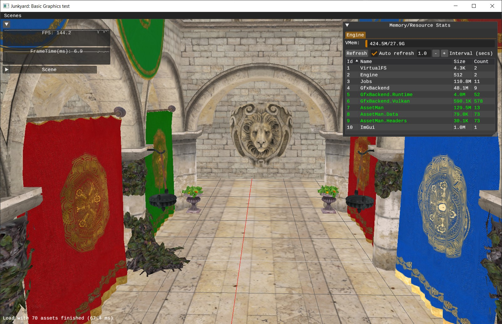

# Junkyard

Yet another portable C++ framework to make games and maybe some other related high-performance applications.

The goal is to focus on simplicity, fast iteration and development. Features will be developed based on the game/projects I do with it, so this is not going to be do-it-all engine/framework at all, but probably with a strong foundation to build your own renderers and other stuff on top of it.

It's very much WIP, so not much to show off right now.



## Overview and Features

- Multiplatform. Currently supported platforms (ARM64, x86_64 architectures only):
    - Windows (Tested on Windows 10 x64)
    - Linux (Tested on Ubuntu 22/PopOS): *Not Tested with latest updates* 
    - MacOS-Arm64 M1 and up (through MoltenVk 1.3): *Not Tested with latest updates*
    - ~~Android~~ (Currently broken, might work with Vulkan 1.3 hardware)
- Minimal C'ish C++20: Some people call it Sane-C++ or similarly [Orthodox-C++](https://gist.github.com/bkaradzic/2e39896bc7d8c34e042b). I use a very small subset of newer C++ standards:
    - No stdc++ allowed in the code
    - No RTTI/Exceptions
    - Relying heavily on POD (Plain-old-data) structs, zero-init by default and avoiding implicit code in ctors/dtors
    - Minimal template functions and macros (mainly used in core containers). No fancy stuff!
- Very strict memory allocation/resource allocation in most systems:
    - Relying heavily on custom allocators especially virtual memory paging and bump allocation
    - Debugging capabilities for memory stats
    - Temp allocator. Which is a push/pop stack based bump allocator used for temporary allocations within the functions/frame
    - Custom memory allocations for GPU
- Design-wise, very much in contrast to *stl*, it has it's own portable C++ Core library: Array, Math, FileIO, HashTable, HandlePool, Buffers, Log, etc: [Core](code/Core). You can also use this core library in your own code, just by grabbing a copy of the folder and copy it over to your program or use `scripts/Code/amalgamate-core.py` script to choose subsets and make one big translation unit or even a single header from Core library.
- Simple [Fiber-based job system](https://www.gdcvault.com/play/1022186/Parallelizing-the-Naughty-Dog-Engine), with custom Signal synchronization primitives.
- Vulkan graphics backend with HLSL shaders (Slang)
- Fast iteration
    - Quick build/compile times (2s debug rebuild)
    - Aim for simple tooling with minimal abstraction or complexity
    - Support for [LivePP](https://liveplusplus.tech/) 
- ImGui integration
- Simple Camera (Orbital + Fps)
- [Tracy profiler](https://github.com/wolfpld/tracy) integration
- Virtual filesystem
- Async asset manager
    - Automatic asset baking with metadata descriptors (PNG/JPG->BCn/ASTC, GLTF->meshoptimizer, HLSL->SPIRV)
    - All asset baking is done on PC and can also be streamed over to other deployment platforms through TCP/IP (server mode)
    - Multithreaded asset loading and baking
    - Local asset caching
    - Hot-reloading assets
        - [x] Shaders
        - [x] Images
        - [x] Models

## Build and Deployment
*PC/Windows* is the primary platform, because it's the platform I use for my daily development. Maintaining build and tooling on multiple OSes is just a lot of work. So please keep in mind that other platforms might be buggy, not as polished or not fully feature complete. To build and run the projects, first thing is running the Setup script after fetching the repo:

### Setup.bat/Setup.sh
After pulling or updating the repo, run this script. This script fetches, heavier dependencies for baking assets. And there is also the option to download and install required or optional SDKs and standalone tools.

So first, you need to run `Setup.bat` (or `Setup.sh` if you are in a Unix environment).

Steps:
- *Install code dependencies*: This is mandatory if you are fetching the code for the first time. It fetches the following binaries:
    - Slang
    - meshoptimizer
    - ISPC Texture compressor
- *Example assets*: Extracts example assets for some examples.
- *Vulkan SDK*: This is also mandatory if you haven't installed it yet. This also fetches vulkan validation layer for all platforms. For windows, make sure `VULKAN_SDK` and `VK_LAYER_PATH` env vars are set.
- *MoltenVK*: (MacOS required) This is a Vulkan-to-Metal translation layer that is required only on MacOS setup.
- *Tracy Profiler*: (optional) This is a very good GUI tool for profiling
- *LivePP*: (Windows optional) A powerful commercial C++ code-reloading software. Note that you'll need a valid license to use this feature.
- Python 3.10+: (Windows optional) If you want some extra script goodies to work, mainly platform helpers, have python installed.

### Windows
Compatible with **Visual studio 2019 (build tools v142)** and **Visual Studio 2022 (build tools v143)** build environments.   
There are multiple ways to build binaries on windows: 
- **Visual studio solution**: The easiest and most convenient method on Windows. open `projects/Windows/Junkyard.sln` and build projects. So far, there are three configurations:
    - `Debug`: The name says it, all debug symbols are included, no optimizations, etc.
    - `ReleaseDev`: Symbols and Tracy profiler is enabled by default in this build. You might want to use this for Profiling and basic release build validation, because it also enables assertions.
    - `Release`: Fully optimized build.
- **Unity Build**: This is a quick way to build without relying on any build systems. You just need a CL compiler. This is useful, because I can build with different compile-flags quickly without the need to blow-up build configurations. For example, ASAN can be built this way just by adding the flag to command-line. To build this way, see related `build-xxxx` batch scripts in `scripts/build` folder.
- **CMake**: Although not the first-class citizen, CMake can also be optionally used to generate projects. Also useful to experiment with other build systems like *Ninja*. It's just a single cmake file and it's in `projects/CMake` directory.

<sub>**Note**: Binaries on windows are built with `/DEBUG:FULL /Zi` so that they are compatible with [RemedyBG debugger](https://remedybg.itch.io/remedybg) and LivePP.</sub>

## Linux
Linux binaries currently can only be built with clang toolset. The most convenient and tested method is using *Visual Studio Code* with the following extensions:
- Clangd
- CMakeTools
- CodeLLDB
  
Just make sure you have already ran `Setup.sh` successfully and have this packages installed (Setup script will try to install them automatically on Ubuntu based distros):
- clang
- cmake
- pkg-config
- libglfw3-dev
- uuid-dev
- libc++-dev
- libc++abi-dev

Then open the project folder with *vscode* and choose your preferred configuration, build and launch with *LaunchLinux* target.

### MacOS
Graphics backend on MacOS runs through the latest MoltenVK which has Vulkan 1.3 support. As usual start with running `Setup.sh` script. Make sure to download tooling library dependencies and MoltenVK. MoltenVK will be downloaded into `$(ProjectRoot)/.downloads` directory. 

Next step is downloading VulkanSDK 1.3 (will be automated later through Setup script) and run it's installer script (`install_vulkan.py` in the VulkanSDK root folder) to install vulkan library into `/usr/local/lib`. The Xcode project links to `libvulkan.dylib` and then by setting `VK_ICD_FILENAMES` environment variable (see Schemes in the Xcode project) to the local `.download/MoltenVK` directory, we make sure that the loader uses our version of MoltenVK. We also set `VK_LAYER_PATH` to the installed vulkan path (Again, see Schemes in the Xcode project), so we can use the always important vulkan validation layer.

And that's it. Open the Xcode project and run your targets.

## Examples
Currently, there are a few very basic examples. First thing to consider is that you must run the examples with **Current Directory** set to the root path of the project so `data` directory can be accessed by them.

**Note**: Example assets are zip compressed in the `data` folder. If you have ran the `Setup.bat` script, it should ask for that and extract it already. For some other examples that use procedurally created assets by the scripts, read `data/README.txt` 

### Remote Asset Baking
Optionally. you can load bake assets remotely through TCP/IP connection. For example, on mobile platforms, There is no deployment of source assets on the device and APKs are kept light and does not contain anything other than executable binaries. So for those platforms, it is actually a requirement to bake assets remotely, after they are baked, they will be cached on the target device.

So to run on mobile/consoles platforms that require server-side asset baking, you should always first start up `JunkyardTool`. It's either included in windows solution or you can use the quick batch scripts that builds and runs it: `scripts/Build/build-run-tool.bat`.

Then, Provide your host PC ip address for `Settings.ini` file: 

```
[Engine]
connectToServer: true
remoteServicesUrl: [HOST_PC_IP]:6006
```

Or set it with command line arguments: `-EngineConnectToServer=1 -EngineRemoteServicesUrl=[host_ip]`

## Documentation
The beginning of headers usually include some important documentation about the API. But separate documents are written and maintained for coding standards, principles or design details.

### Coding standard and rules
For some general coding and styling rules see [Coding Standard](doc/misc/CodingStandard.md)

### Blog posts and design documents
Design documents can be browsed offline locally. The [main page](doc/index.md.html) is under `doc` folder:
- [**Introduction**](doc/junkyard-intro/index.md.html): It's just an introduction to design principles, goals and essential 3rdparty tools that I use.
- [**Memory Basics**](doc/junkyard-memory-01/index.md.html): This covers basic memory allocation and design at the core level. It's an essential read if you want to make the best use of memory and understand the memory concepts behind the engine.
- [**Relative Pointers**](doc/junkyard-relativeptr/index.md.html): A kind of a follow up to the memory basics. Covers the concept of *Relative Pointers* used in some parts of the engine, especially binary serialization.
- [**Project Structure**](doc/junkyard-struct/index.md.html): Covers build structure and platform projects in more detail, directory structures and basic things you should know about adding modules and dependency checking between the modules. 
- [**Asset Manager**](doc/junkyard-assetman/index.md.html): Asset manager design goals and details on the internals. Also quite useful if someone wants to add a new asset type to the engine.

## Dependencies
External dependencies are a pretty big deal imo, so I'm going to pay special attention to them. They are part of your code even if you don't write them yourself and they all play a big role in compile-times, maintenance, deployment and technical debt of your code. So I try to keep the dependencies small and to minimum. Most of the dependencies here are simple stb-style single-header C libs, but some just can't be as small and quick-to-compile as I want them to be (eg Physics/Audio/Baking/ShaderCompilers/etc), usually those ones are downloaded off the internet and not part of the repo. Anyway, here they are:

- [Git](https://git-scm.com/downloads) and ~~[Git LFS](https://git-lfs.com/)~~: Source control
- [VulkanSDK](https://vulkan.lunarg.com/): Used for the graphics backend. 
- [c89atomics](https://github.com/mackron/c89atomic): Replacement for std atomics. Don't want to use `<atomic>` because it's part of std-C++ crap and it's [huge](https://build-bench.com/b/-_WeHavwOPkGBvI3ed5KNnpdgmk), and C11 `<stdatomic>` is not available for msvc2019. I might try to remove this for `<stdatomic>` if I intend to ditch msvc2019 and go strictly for msvc2022.
- [cj5](https://github.com/septag/cj5): single-header [JSON5](https://json5.org/) parser.
- [Tracy profiler](https://github.com/wolfpld/tracy): Frame profiler
- [dds-ktx](https://github.com/septag/dds-ktx): Portable single header DDS/KTX reader for C/C++
- [dmon](https://github.com/septag/dmon): Tiny C library that monitors changes in a directory
- [ImGui](https://github.com/ocornut/imgui): Bloat-free graphical user interface library for C++
- [ImGuizmo](https://github.com/CedricGuillemet/ImGuizmo): ImGui gizmo and some other useful widgets
- [INI parser](https://github.com/mattiasgustavsson/libs/blob/main/ini.h): Mattias Gustavsson single-header lib for parsing INI files
- [minicoro](https://github.com/edubart/minicoro): Single header asymmetric stackful cross-platform coroutine library in pure C.
- [stb](https://github.com/nothings/stb): stb single-file public domain libraries for C/C++
- [tlsf](https://github.com/mattconte/tlsf): Two-Level Segregated Fit memory allocator implementation.
allocation library
- [OffsetAllocator](https://github.com/septag/OffsetAllocator): Fast O(1) offset allocator with minimal fragmentation (Used for GPU dynamic memory allocations). I maintain my own single-header fork of the original project.
- [volk](https://github.com/zeux/volk): Meta loader for Vulkan API
- [sokol_args](https://github.com/floooh/sokol/blob/master/sokol_args.h): Single-header lib for parsing command-line arguments
- Tooling (only used in tooling/PC builds):
    - [ISPC Texture Compressor](https://github.com/septag/ISPCTextureCompressor): BC/ASTC texture compressor
    - [meshoptimizer](https://github.com/zeux/meshoptimizer): Mesh optimization library that makes meshes smaller and faster to render
    - [slang](https://github.com/shader-slang/slang): Shader trans-compiler
- Windows:
    - [DbgHelp](https://learn.microsoft.com/en-us/windows/win32/debug/dbghelp-functions): Windows debug helper module. 
- Linux
    - [GLFW](https://www.glfw.org/): Basic window/input management that is only used for the Linux backend
- Optional Tools:
    - [LivePP](https://liveplusplus.tech): Commercial tool for Hot-reloading C++ code. This software is magic!
    - [MemPro](https://puredevsoftware.com/mempro/index.htm): Commercial tool for debugging memory allocations
    - [Python 3.10+](https://www.python.org/downloads/): Optional but highly recommended. Used in some tooling scripts and utilities. 
    - [ScrCpy](https://github.com/Genymobile/scrcpy): Display and control your Android device
    - [Gnirehtet](https://github.com/Genymobile/gnirehtet): provides reverse tethering for Android

## [License (MIT)](https://github.com/septag/Junkyard/blob/main/LICENSE)

<a href="http://opensource.org/licenses/MIT" target="_blank">

</a>
    MIT License

    Copyright (c) 2023 Sepehr Taghdisian

    Permission is hereby granted, free of charge, to any person obtaining a copy
    of this software and associated documentation files (the "Software"), to deal
    in the Software without restriction, including without limitation the rights
    to use, copy, modify, merge, publish, distribute, sublicense, and/or sell
    copies of the Software, and to permit persons to whom the Software is
    furnished to do so, subject to the following conditions:

    The above copyright notice and this permission notice shall be included in all
    copies or substantial portions of the Software.

    THE SOFTWARE IS PROVIDED "AS IS", WITHOUT WARRANTY OF ANY KIND, EXPRESS OR
    IMPLIED, INCLUDING BUT NOT LIMITED TO THE WARRANTIES OF MERCHANTABILITY,
    FITNESS FOR A PARTICULAR PURPOSE AND NONINFRINGEMENT. IN NO EVENT SHALL THE
    AUTHORS OR COPYRIGHT HOLDERS BE LIABLE FOR ANY CLAIM, DAMAGES OR OTHER
    LIABILITY, WHETHER IN AN ACTION OF CONTRACT, TORT OR OTHERWISE, ARISING FROM,
    OUT OF OR IN CONNECTION WITH THE SOFTWARE OR THE USE OR OTHER DEALINGS IN THE
